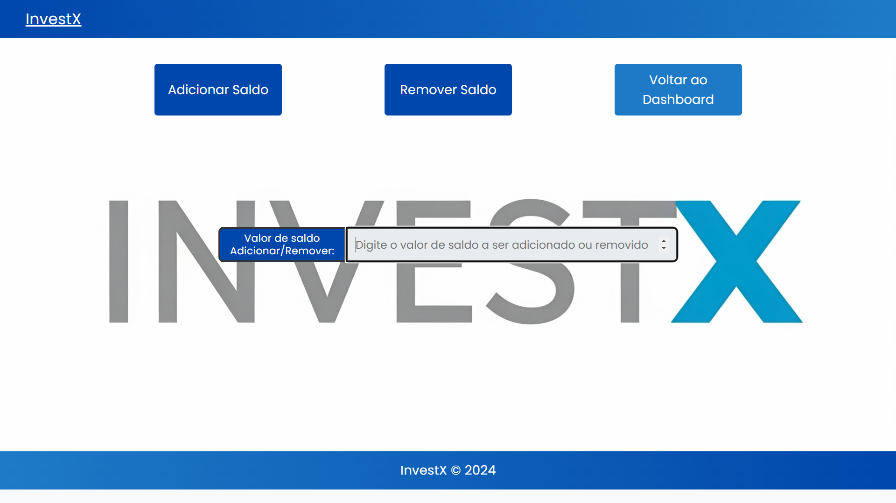

# Carteira de Investimentos

**Descrição:**
Front-end da aplicacao da carteira de investimentos. Feito com o auxilio do Google Gemini, juntamente com o template incial clonado do projeto login-page desenvolvido pela desenvolvedora e youTuber Fernanda Kipper.

**Tecnologias:**
* AngularTS
* Node.js

**Instalação:**
1. Clone este repositório: `https://github.com/CarlosNazario2010/carteira-investimentos-frontend.git`
2. Instale as dependências: `npm install`   

**Execução:**
`npm start`

**Tela Home:**
Tela inicial da Aplicacao. Possui os botoes Login para entrar no sistema caso o usuario ja tem um cadastro no sistema, e o botao SignUp para realizar o cadastro no sistema

**Tela SignUp:**
Tela para realizar o cadastro do cliente. Os dados que devem ser informados sao: Nome, CPF, email e senha (que deve ser confirmada). Caso algum dado invalido seja colocado (cpf invalido, email invalido, ou um cpf que ja esteja cadastrado no sistema) a aplicacao informara uma mensagem de erro

**Tela Login:**
Tela para realizar o login do usuario na aplicacao. Os dados que devem ser informados sao: cpf e senha. Caso dados invalidos sejam informados (cpf invalido ou nao cadastrado ou senha invalida) o sistema retornara uma mensagem de erro

**Tela Gerenciar Carteira:**
Tela para gerenciar o status da carteira. Caso o usuario consiga se logar com sucesso na aplicacao o botao Recarregar Carteira fica disponivel

Ao clicar no botao Gerenciar Carteira, caso o usuario ainda nao possua uma carteira, o botao Criar Carteira fica habilitado

Ao criar a Carteira o botao Ir para o Dashboar fica habilitado. Caso o usuario, ao se logar na aplicacao, ja possuir uma carteira, tera o botao Ir para o Dashboard ficar habilitado ao clicar no botao Recarregar Carteira (nesse caso o botao Criar Carteira jamais eh habilitado)

**Tela Dashboard:**
Tela principal da aplicacao, onde o usuario pode consultar sua carteira. Ela possui botoes na parte superior que chamam as funcionalidade conforme a imagem a seguir.

**Tela Adicionar/Remover Saldo:**
Tela que permite a adicionar ou remover saldo na carteira, necessario para a compra de ativos. Caso o usuario tente remover um saldo maior que possui (tentar ficar com saldo negativo) a aplicacao lancara uma mensagem de erro. O saldo sera atualizado na tela de dashboard do usuario

**Tela Comprar Ativo:**
Tela que permite a compra de ativos. Possui os campos a serem preenchidos: Ticker, Quantidade, Preco e Tipo. O ticker dever ser um ativo valido negociado na B3. Quantidade e preco tambem devem ser valores validos. E os tipos permitidos sao: ACAO, FII, BDR e ETF

**Tela Comprar Ativo (mensagem de sucesso):**
Caso o usuario faca a compra corretamente a aplicacao informara com uma mensagem de compra realizada com sucesso

**Tela de Dashboard (atualizado com a compra do ativo):**
A tela de dashboard do usuario sera atualizada com  o ativo comprado. Varias informacoes do ativo podem ser visualizadas conforme a tela a seguir. Inclusive os valores informados pela API externa da Brapi implmentada no backend da aplicacao

**Tela de Compra (nova compra mesmo ativo):**
Tela de compra novamente, agora com uma nova compra de um ativo que ja existe na carteira

**Tela de Dashboard (apos a compra de um ativo existente na carteira):**
Tela de Dashboard apos a compra de um ativo que ja existe na carteira. Nesse caso a quantidade de ativos da carteira eh atualizada com um novo preco medio para este ativo. Todos os demais dados tambem sao atualizados conforme a nova compra

**Tela de Compra (nova compra de um ativo nao existente na carteira):**
Tela de compra novamente, agora realizando a compra de um ativo ainda nao existente na carteira

**Tela de Dashboard (apos a compra de um ativo nao existente na carteira):**
Tela de dashboard apos a compra de uma ativo ainda nao existente na carteira. Nesse caso a lista de ativos aumentara com a adicao de um novo ativo. Todos os outros indicadores serao atualizados conforme a compra do novo ativo

**Tela de Vender Ativo:**
Tela que permite a venda de ativos. Possui os campos a serem preenchidos: Ticker, Quantidade, Preco de Venda e Tipo. A exemplo da Compra de Ativos, caso algum dado invalido for inserido (ou se tentar vender um ativo que nao se possui, ou em quantidade insuficiente), a aplicacao lancara uma mensagem de erro 

**Tela de Dashboard (apos a venda de algum ativo):**
Tela de dashboard novamente, com a atualizacao apos a venda do ativo

